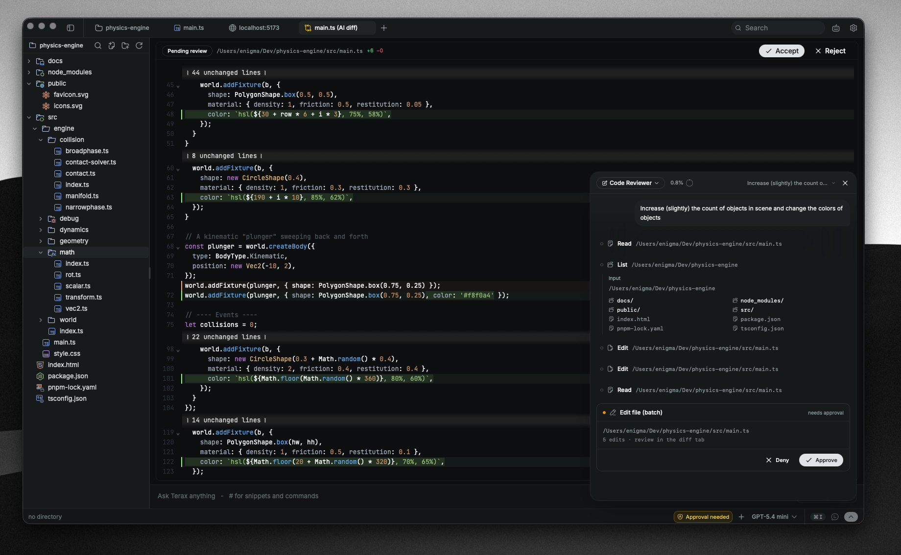

<div align="center">
  
  <h1>Terax 中文版</h1>

  <p><strong>开源轻量级跨平台 AI 原生终端 (ADE)</strong></p>

  <p>
    
    
    
    
  </p>
</div>

---

> **声明**：本项目是 [Terax](https://github.com/crynta/terax-ai) 的中文汉化版本，原作者为 [Crynta](https://github.com/crynta)。本汉化版本遵循 Apache License 2.0 协议。

## 📦 下载

本仓库通过 GitHub Actions 自动构建 **Windows 安装包**，请在 [Actions](https://github.com/cymylive/terax-ai-cn/actions) 页面选择最新的成功构建，在 Artifacts 中下载 `Terax-Windows.zip`。

## 🚀 项目简介

Terax 是一款快速、轻量的 **AI 原生终端 (ADE)**，基于 **Tauri 2 + Rust + React 19** 构建。它将原生 PTY 后端与现代 UI 相结合——多标签终端、集成代码编辑器、文件资源管理器，以及一流的 AI 侧边面板（支持 API 密钥或通过 LM Studio 完全本地运行）。

磁盘占用不到 **10 MB**，无遥测，密钥存储在系统密钥链中。

## ✨ 功能特性

### 🖥️ 终端

- xterm.js + WebGL 渲染器，多标签支持后台流式传输
- 原生 PTY 后端（支持 zsh、bash、pwsh、cmd、fish 等）
- **分屏面板** — 支持水平/垂直拆分终端
- **右键关闭面板** — 在拆分终端上右键 → "关闭"，可单独关闭某个面板
- 内联搜索（`Ctrl+Shift+F`）、链接检测、真彩色支持
- Shell 集成（OSC 7 目录报告、OSC 133 提示符标记）
- 文件拖放 — 从资源管理器拖入文件，自动写入完整路径

### 📝 编辑器

- CodeMirror 6，支持 TS/JS、Rust、Python、HTML/CSS、JSON、Markdown 等语言
- 内联 AI 自动补全和 AI 编辑差异对比
- Vim 模式
- 预置主题：Tokyo Night、Nord、GitHub Dark/Light、Atom One、Aura、Copilot、Xcode Dark/Light

### 📁 文件资源管理器

- Catppuccin 图标主题（Material Icon Theme 解析器）
- 模糊搜索、键盘导航、内联重命名
- 右键菜单：在终端中打开、在文件管理器中显示、复制路径、附加到 AI Agent
- 两步确认删除，防止误操作

### 🌐 网页预览

- 自动检测本地开发服务器并在预览标签中打开
- 内置轻量浏览器，支持地址栏导航

### 🧠 AI（自带密钥）

- 支持提供商：OpenAI、Anthropic、Google、Groq、xAI、Cerebras、OpenAI 兼容接口
- 通过 **LM Studio** 支持本地/离线模型
- 语音输入、编辑差异对比、多代理和子代理
- 代码片段/技能、可自定义系统提示词
- `TERAX.md` 用于项目记忆和配置
- 任务、计划、搜索、文件读写工具，支持审批流程

### 🔧 系统托盘

- **关闭到托盘** — 点击 × 时最小化到系统托盘而非退出（可在设置中开关）
- **左键点击托盘图标** — 切换窗口显示/隐藏
- **右键托盘菜单** — "Show Terax" 显示窗口 / "Quit" 彻底退出程序

### 🌍 国际化

- 完整的中文本地化支持
- 简体中文 / English 一键切换（设置 → 通用 → 语言）
- 基于 i18next 的完整翻译覆盖

### 📋 其他

- 轻量快速（约 7 MB 打包体积）
- API 密钥存储在系统密钥链中
- 无遥测，无需账号
- 自动恢复窗口位置和大小
- 开机自启动（可在设置中开启）

## 🖼️ 界面展示

<table>
  <tr>
    <td align="center"><br/><sub>多标签终端，支持 WebGL 渲染和分屏</sub></td>
    <td align="center"><br/><sub>本地开发服务器网页预览</sub></td>
  </tr>
  <tr>
    <td colspan="2" align="center"><br/><sub>AI 代理工作流，支持代码编辑器中的编辑差异对比</sub></td>
  </tr>
</table>

## ⚙️ 配置 AI

1. 打开 **设置 → AI**（或按 `Ctrl+,` / `Cmd+,`）
2. 选择提供商并粘贴你的 API 密钥
3. 对于本地推理，将 Terax 指向你的 LM Studio 端点（`http://localhost:1234`）
4. 密钥通过 `keyring` 写入**系统密钥链**——它们永远不会接触磁盘或 `localStorage`

## ⌨️ 快捷键

| 快捷键 | 功能 |
|--------|------|
| `Ctrl+Shift+T` | 新建终端标签页 |
| `Ctrl+W` | 关闭当前标签页/面板 |
| `Ctrl+Tab` / `Ctrl+Shift+Tab` | 切换标签页 |
| `Ctrl+Shift+F` | 在终端中搜索 |
| `Ctrl+\`` | 切换 AI 面板 |
| `Ctrl+Shift+S` | 水平拆分终端 |
| `Ctrl+Shift+V` | 垂直拆分终端 |
| `Alt+Enter` | 全屏切换 |
| `Ctrl+,` | 打开设置 |

> 所有快捷键可在 **设置 → 快捷键** 中自定义。

## 🔧 设置

| 设置项 | 位置 | 说明 |
|--------|------|------|
| 主题 | 通用 → 外观 | 系统/浅色/深色 |
| 语言 | 通用 → 语言 | 中文/English |
| 编辑器主题 | 通用 → 编辑器主题 | 10 种预置主题 |
| Vim 模式 | 通用 → Vim 模式 | CodeMirror Vim 键绑定 |
| 字体大小 | 通用 → 终端 → 字体大小 | 10-32px 可调 |
| WebGL 渲染 | 通用 → 终端 → WebGL | 硬件加速，卡顿时可关闭 |
| 开机自启 | 通用 → 启动 → 登录时启动 | 开机自动打开 Terax |
| 关闭到托盘 | 通用 → 启动 → 关闭到托盘 | × 按钮隐藏到托盘而非退出 |
| 恢复窗口 | 通用 → 启动 → 恢复窗口 | 下次启动恢复上次窗口位置 |

## 🔨 从源码构建

### 前置要求

- Rust（stable）— [rustup.rs](https://rustup.rs)
- **Node.js 20+** + **[pnpm](https://pnpm.io)**
- [Visual Studio Build Tools](https://visualstudio.microsoft.com/visual-cpp-build-tools/)（Windows，含 MSVC v143 + Windows SDK）
- 其他平台特定的 Tauri 前置要求 — [Tauri 官方文档](https://tauri.app/start/prerequisites/)

### 国内加速

在项目根目录创建 `.npmrc`：

```ini
registry=https://registry.npmmirror.com
electron_mirror=https://npmmirror.com/mirrors/electron/
```

Rust 国内源（`~/.cargo/config.toml`）：

```toml
[source.crates-io]
replace-with = "ustc"
[source.ustc]
registry = "sparse+https://mirrors.ustc.edu.cn/crates.io-index/"
```

### 运行

```bash
# 安装依赖
pnpm install

# 跳过原生模块构建（如不需要 Rust 原生能力）
$env:SKIP_NATIVE_BUILD = "true"   # Windows PowerShell

# 开发模式（热更新）
pnpm tauri dev

# 生产打包
pnpm tauri build

# 仅 Windows 打包
pnpm tauri build --windows
```

### 代码检查

```bash
pnpm exec tsc --noEmit          # 前端类型检查
cd src-tauri && cargo clippy    # Rust 代码检查
```

## 🏗️ 技术栈

| 层 | 技术 |
|----|------|
| 桌面壳 | Tauri 2 |
| 后端 | Rust（`portable-pty`、`keyring`、`reqwest`） |
| 前端 | React 19 + TypeScript + Vite |
| 终端 | xterm.js + WebGL |
| 编辑器 | CodeMirror 6 + Vim |
| AI | Vercel AI SDK v6 |
| 国际化 | i18next + react-i18next |
| 样式 | Tailwind v4 + shadcn/ui |
| 状态管理 | Zustand |

## 🗺️ 项目结构

```
terax-ai-cn/
├── src/                    # 前端源码 (React + TypeScript)
│   ├── app/                # 主应用组件
│   ├── components/         # 通用 UI 组件
│   ├── i18n/               # 国际化 (中/英)
│   ├── lib/                # 工具函数
│   ├── modules/            # 功能模块
│   │   ├── ai/             # AI 聊天、Agent、工具
│   │   ├── editor/         # CodeMirror 编辑器
│   │   ├── explorer/       # 文件资源管理器
│   │   ├── header/         # 顶部标题栏
│   │   ├── preview/        # 网页预览
│   │   ├── settings/       # 设置管理
│   │   ├── shortcuts/      # 快捷键系统
│   │   ├── statusbar/      # 底部状态栏
│   │   ├── tabs/           # 标签页管理
│   │   ├── terminal/       # 终端面板 (xterm.js)
│   │   ├── theme/          # 主题系统
│   │   └── workspace/      # 工作区环境
│   ├── settings/           # 设置页面
│   └── styles/             # 全局样式
├── src-tauri/              # Rust 后端
│   ├── src/                # Rust 源码
│   │   ├── modules/        # 后端模块
│   │   │   ├── fs/         # 文件系统操作
│   │   │   ├── net/        # 网络请求
│   │   │   ├── pty/        # PTY 终端
│   │   │   ├── secrets/    # 密钥链管理
│   │   │   ├── shell/      # Shell 命令
│   │   │   └── workspace/  # WSL 工作区
│   │   ├── lib.rs          # Tauri 应用入口
│   │   └── main.rs         # 主函数
│   ├── capabilities/       # 权限配置
│   ├── icons/              # 应用图标
│   └── tauri.conf.json     # Tauri 配置
├── .github/workflows/      # GitHub Actions CI/CD
├── docs/                   # 文档资源
└── package.json            # 前端依赖
```

## 🤝 贡献

欢迎 Issue 和 PR！请随时提交问题、建议功能或拉取请求。详见 [CONTRIBUTING.md](CONTRIBUTING.md)。

## 📄 许可证

本项目基于 **Apache License 2.0** 许可证。详见 [LICENSE](LICENSE)。

## 🙏 致谢

- 原项目：[terax-ai](https://github.com/crynta/terax-ai)
- 原作者：[Crynta](https://github.com/crynta)
